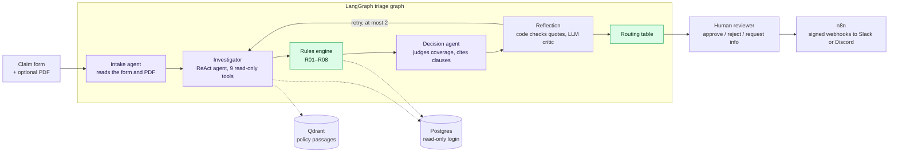

# ClaimFlow

Agentic insurance claim triage. LLM agents read the claim, investigate it with read-only tools and judge coverage
against the policy wording. A deterministic rules engine applies the fraud and eligibility checks. Fixed code turns
both into a recommendation, and a person makes the final decision.

> Decisions produced by ClaimFlow are AI-assisted recommendations that require human review.
> They are not automated determinations.

## How a claim flows



Purple steps call an LLM. Green steps are plain code. Reflection is both: code verifies every quote first, and the
LLM critic runs only if that passes.

### What is agentic and what is not

The rule behind the design: **an agent may gather evidence and give a judgment, but it never decides the outcome.**

| Step | Kind | What it does | Why this kind |
|---|---|---|---|
| Intake | LLM | Extracts fields from the description and PDF, and flags mismatches with the form | Free text needs reading |
| Investigator | LLM, ReAct | Chooses which of 9 read-only tools to call: policy search, exclusions, waiting periods, policy status, claim history, payments and more | Which evidence a claim needs varies. A simple claim and a lapsed-policy claim make different tool calls (checked by `scripts.compare_investigations`) |
| Rules R01–R08 | Code | Checks amount against sum insured, lapse, new policy, frequency, future or pre-policy dates, duplicates and KYC | Eligibility must be exact and auditable. The rules read only database facts, never agent output |
| Decision | LLM | Judges coverage from the policy wording, with a confidence and a citation for every point | Interpreting wording against a story |
| Reflection | Code, then LLM | Code checks that every quote appears in the passage it cites; the critic judges grounding | Code catches invented quotes with certainty; the model judges what code cannot |
| Routing | Code | APPROVE, REJECT or ESCALATE from hard blocks, risk score, amount and confidence | The agent contributes exactly two values, *covered* and *confidence*. A confident "covered" cannot get past a hard block |
| Final decision | Person | Confirms, overrides or requests information | Every recommendation requires human review |

Some safeguards follow from this split:
- Routing uses the **lower** of the agent's confidence and the retrieval confidence of the weakest cited passage.
- Claims above 100,000 always go to a person.
- Agent tools connect with a Postgres login that can only `SELECT` four tables.
- Uploaded PDFs are deleted as soon as their text is extracted.

## Evaluation

Each level has its own script and labelled data. The method, the 20 labelled claims and every result are in
[docs/EVALUATION.md](docs/EVALUATION.md).

| Level | Result |
|---|---|
| Retrieval, 12 labelled questions | Recall@5 **1.00**, MRR 0.86. Off-topic questions score 0.00 confidence, so they always escalate |
| Rules R01–R08 on the seed | Each labelled edge case triggers exactly its rule. Every other seeded claim triggers none |
| Deterministic safety | Tests show an agent cannot override a hard block, and weak retrieval escalates even a confident agent |
| End-to-end triage, 20 labelled claims | Harness complete; scoring in progress under free-tier quotas (below) |

**The key metric is unsafe approvals:** approving a claim that should have been rejected or escalated. The target is
zero, and the evaluation script fails if it isn't.

**Reflection tuning** (Phase 12):
- Before the fix, 4 of 5 recorded reflection retries asked for facts no tool can supply, such as "was the vehicle
  locked?". Those claims used up their retries and escalated anyway.
- The critic now has to name the tool for each lookup.
- Anything no tool can answer goes to the reviewer as an **open question** on the decision card, instead of
  triggering a retry.

## Quick start

```bash
cp .env.example .env                  # add GROQ_API_KEY and/or GOOGLE_API_KEY
docker compose up -d                  # builds, migrates, seeds, starts the API, Postgres and Qdrant
curl http://localhost:8000/api/health
docker compose exec backend pytest    # about 600 tests, no LLM calls

cd frontend
cp .env.example .env.local            # API_KEY must match the one in the root .env
npm install && npm run dev            # reviewer console at http://localhost:3000
```

If anything misbehaves, run the doctor first. It checks each of the following and prints the command that fixes any
problem:
- Postgres and the read-only login;
- Qdrant and the embedding model;
- each LLM key and model, with one tiny call;
- the API key and the console's key;
- the n8n signature.

```bash
docker compose exec backend python -m scripts.doctor             # add --offline to skip LLM calls and the n8n ping
```

The seed creates 50 customers, 80 policies and 200 claims. It includes 8 labelled edge cases, one per rule R01–R08,
and every other claim is generated to trigger no rule.

### The console

| Page | What it shows |
|---|---|
| Dashboard | Claims per day, escalation rate, auto-decision share and pending work |
| Claims | Search and filter every claim |
| Claim detail | The live trace of each agent step and tool call (streamed over SSE), the recommendation with cited clauses, open questions for the claimant, and the approve, reject or request-info actions |
| New claim | The claim form, with an optional PDF |
| Policies | The policy book |

### Calling the API

- Interactive docs are at http://localhost:8000/api/docs.
- Every endpoint except `/api/health` needs the `X-API-Key` header (`API_KEY` in `.env`).
- Errors are RFC 7807 `application/problem+json`.

```bash
curl -H "X-API-Key: dev-local-api-key-change-me" "http://localhost:8000/api/claims?page_size=5"
```

### MCP server (Claude Desktop)

`scripts.run_mcp` serves the following over MCP:
- the investigator's 9 read-only tools;
- the resources `claimflow://policies/list` and `claimflow://claims/pending`;
- the prompt `triage_claim`.

To use it in Claude Desktop:
1. Copy the `claimflow` entry from [mcp/claude_desktop_config.json](mcp/claude_desktop_config.json) into
   `%APPDATA%\Claude\claude_desktop_config.json` (Windows) or
   `~/Library/Application Support/Claude/claude_desktop_config.json` (macOS).
2. Fix the path to `docker-compose.yml`.
3. Restart Claude Desktop.

Only Docker Desktop needs to be running. Nothing it exposes can write; see [SECURITY.md](SECURITY.md).

### Notifications and deployment

n8n verifies each event's HMAC signature and posts a Slack-compatible message: to Slack, or to Discord through a
Discord webhook URL ending in `/slack`. To turn it on:
- set `N8N_WEBHOOK_URL`, `WEBHOOK_SECRET` and `NOTIFY_WEBHOOK_URL` in `.env`;
- add `COMPOSE_PROFILES=notifications`, so `docker compose up -d` starts n8n too.

Deployment is **free**: `render.yaml` deploys the API and the console (behind HTTP Basic auth) to Render's free
plan, with Neon Postgres and a Qdrant Cloud cluster, both free. The API fits a 512 MB instance because production
runs the embedding model as ONNX, without torch. [docs/DEPLOYMENT.md](docs/DEPLOYMENT.md) walks through it and
lists every environment variable.

### What happens on every backend start

| Step | Behaviour |
|------|-----------|
| Image | `pull_policy: build` rebuilds on every `up`. It's cached and takes seconds, so a stale image can't run. |
| Dependencies | The entrypoint reinstalls packages if the dependency lists in `pyproject.toml` changed. |
| Migrations | `scripts.migrate` upgrades the schema and adopts untracked tables that match the models exactly. If they don't match, it stops with instructions. |
| Read-only role | `scripts.provision_readonly_role` creates the agent tools' login (`AGENT_DB_USER`) with SELECT on four tables and nothing else, then verifies it cannot write. |
| Seed data | `scripts.seed` seeds an empty database, and refreshes untouched seed data from an earlier day. It never wipes data the app has written. |

### Resetting the development database

```bash
docker compose run --rm backend python -m scripts.reset_db --yes   # wipe Postgres, migrate, seed
docker compose exec backend python -m scripts.seed --reset          # reload seed data only
```

`reset_db` leaves Qdrant untouched, unlike `docker compose down -v`, which deletes every volume.

## Tech stack

| Area | Choice |
|---|---|
| API | FastAPI, Pydantic v2, SQLAlchemy 2 (async), Alembic, Postgres 16 |
| Agents | LangGraph. Groq (`openai/gpt-oss-120b`) first, Gemini 2.5 Flash as the fallback, both at temperature 0 |
| Retrieval | `all-MiniLM-L6-v2`: sentence-transformers in development, its ONNX export (onnxruntime) in production. Qdrant |
| Tools over MCP | FastMCP (stdio for Claude Desktop, HTTP with a bearer token) |
| Console | Next.js 14, TypeScript, Tailwind, shadcn/ui, TanStack Query, Recharts, framer-motion |
| Operations | Docker (multi-stage, non-root), n8n, Render, pytest, ruff |

## Repository layout

```
backend/app/agents     intake, investigator, decision, reflection, the graph, the LLM provider chain, evaluation
backend/app/rules      R01–R08, thresholds, and the routing table (no LLM imports; a test enforces it)
backend/app/tools      the 9 read-only investigator tools
backend/app/retrieval  PDF extraction, chunking, embeddings, the retriever and its evaluation
backend/app/mcp        the MCP server over the same tools
backend/scripts        seed, migrate, doctor, evaluations, MCP entry point
backend/data           policy PDFs, labelled evaluation sets and results
frontend               the reviewer console
n8n                    the notification workflow
docs                   deployment and evaluation
```

## Limitations

- **Free-tier LLM quotas limit throughput.**
  - One claim takes about 12–18 LLM calls and over 30,000 tokens.
  - Groq's free tier allows 8,000 tokens a minute, with a daily token limit that works as a rolling 24-hour window.
    Gemini's free tier allows 20 requests a day.
  - So on free keys a claim takes minutes, only a handful fit in a day, and the full 20-claim evaluation spans
    several days. A paid key removes this.
  - Shortening the prompts is the next optimisation. Each investigator step resends the evidence gathered so far.
- **The evaluation set is small and self-labelled.**
  - It has 20 claims, labelled by the developer against three short, fictional policy wordings (about 5,000 words
    in total), not by claims professionals.
  - It shows the pipeline behaves as designed. It is not an accuracy estimate for real claims.
- **The LLM output can vary.** At temperature 0 a re-run usually gives the same recommendation, but providers don't
  guarantee it. Routing and rules are fully deterministic.
- **There is no real identity management.**
  - The API uses one shared key and the console uses HTTP Basic auth.
  - A reviewer's name is typed in with each decision, not taken from a login, so it is not an authenticated
    identity. SSO would be needed for real use.
- **There is no OCR.** Scanned PDFs without a text layer are rejected with a message. Only text PDFs can be read.
- **It runs as a single process.**
  - Live-trace events are held in the API process's memory, and graph checkpoints use SQLite.
  - Running several API workers would need a shared broker (for example Redis) and the Postgres checkpointer.
- **Uploaded documents are not kept.** Only the extracted text is used for the run, and the file is deleted. That is
  good for privacy, but a reviewer cannot reopen the original PDF.
- **The rules are illustrative.** The 8 rules and their thresholds show the pattern, not an insurer's actual
  underwriting policy. Amounts are in INR, and the wordings follow Indian policy conventions.

## Security

See [SECURITY.md](SECURITY.md) for the MCP server's threat model:
- what it exposes, and the read-only database role behind it;
- SQL and prompt injection (untrusted text is fenced, and no tool can write);
- data exposure and secrets.

Events sent to n8n are signed with HMAC-SHA256 and rejected after 5 minutes; see [n8n/README.md](n8n/README.md).
